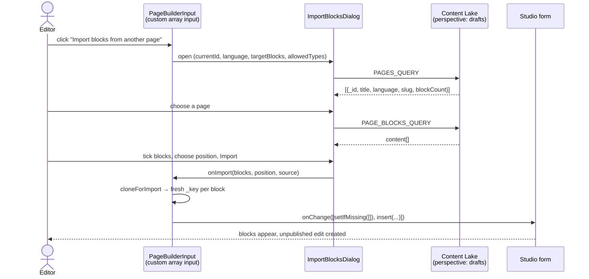

# Import blocks from another page

A Studio feature for the landing-page **page builder**. Editors can reuse blocks from any other page (one, several or all of them) and insert them at a chosen position. It doesn't use the system clipboard.

- **Code:** `sanity/components/page-builder/`
- **Wired up in:** `sanity/schemaTypes/page.ts` → `content` field → `components.input`
- **Added:** 2026-09-29 · Sanity 6.9 · `@sanity/ui` 4 · `@sanity/icons` 5

---

## 1. Why this exists

Sanity has built-in copy and paste: **Copy field** / **Paste field** in a field's ⋯ menu, and **Copy** in an array item's menu. It reads and writes the **operating system clipboard** (`navigator.clipboard.read()` / `.write()`), which makes it fragile in practice:

| Problem | Cause |
|---|---|
| "Clipboard access blocked" | The browser denied clipboard permission. This is common when the Studio runs **inside the Sanity Dashboard iframe**, where clipboard access depends on the parent frame's permissions (sanity.io's markup, not ours). |
| "Nothing to paste" / "Invalid clipboard item" | Something else was copied in between. The clipboard holds only one item. |
| Paste seems to do nothing in Safari | Safari shows a small **Paste** confirmation bubble that is easy to miss. |
| Paste goes to the wrong place | A pasted item is always **appended at the end**, and pasting a whole field **replaces** the target array. |

This feature reads the source page **directly from the Content Lake** through the Studio's authenticated client, so none of those problems apply.

The built-in copy and paste still works where the clipboard is available. This feature adds another way to do it.

---

## 2. What editors see

Below the **Page builder** field (Content tab of a landing page) there is a button:

> **⤓ Import blocks from another page**

1. **Pick a page.** Every other landing page is listed with its title, slug, language badge and block count. Pages in the **same language as the current page are listed first**. Search filters by title or slug. Pages with no blocks can't be selected.
2. **Pick blocks.** The page's blocks appear with their normal Studio previews. **All blocks are selected by default.** Untick the ones you don't want, or use **Select all** to toggle all of them.
3. **Pick a position** in the footer: *at the end*, *at the beginning*, or *after* any block already on the page.
4. **Import N blocks.** The blocks are inserted as normal unpublished edits, and a toast confirms the import. Publish the page as usual. **Undo** (⌘Z) reverts the import.

**Rules:**

- The page being edited is never offered as a source. Use the block's **Duplicate** action for that.
- **Admin-only pages** are only offered to Studio admins (`NEXT_PUBLIC_SANITY_ADMIN_EMAILS`), the same rule as the desk structure.
- The button is hidden when the field is read-only, for example when an editor opens an admin-only page.
- **Cross-language import is allowed** (e.g. EN → DE), with a warning: the text stays in the source language until it is translated. This is deliberate, because it's a quick way to start a translation from an existing layout.
- Unpublished edits on the source page are included (see the `drafts` perspective in §4).

---

## 3. How it works



There are three files, one per concern:

| File | Role | React? |
|---|---|---|
| `import-blocks.ts` | GROQ queries, key regeneration, patch building, labels | No: pure functions |
| `ImportBlocksDialog.tsx` | Page picker → block picker → position → import | Yes: UI state only |
| `PageBuilderInput.tsx` | Renders the default array input plus the button, and applies the patches | Yes: glue |

---

## 4. Tutorial: building it step by step

The code below matches the files in `sanity/components/page-builder/` as of this writing. **The files are the source of truth.** Use this section to understand them and to rebuild the pattern elsewhere.

### Step 0: dependencies

`sanity` already depends on `@sanity/ui` and `@sanity/icons`, but pnpm only lets you import **direct** dependencies. Add them with the same versions the installed `sanity` uses, so there is only one copy of each:

```bash
pnpm add @sanity/ui@4.0.3 @sanity/icons@5.2.1
```

> ⚠️ **Two v4/v5 gotchas that cost time:**
> - `@sanity/icons` 5 exports each icon from its **own subpath**. `import { DownloadIcon } from "@sanity/icons"` typechecks but **fails at build time** ("Export DownloadIcon doesn't exist in target module"). Use `import { DownloadIcon } from "@sanity/icons/Download"`.
> - `@sanity/ui` 4 renamed `<Stack space>` to **`<Stack gap>`**, and moved `useToast` to **`@sanity/ui/toast`**.

### Step 1: pure helpers (`import-blocks.ts`)

Keep everything that isn't UI out of React. That keeps it readable and testable.

```ts
import { insert, setIfMissing, type FormPatch } from "sanity";

export type PageSummary = {
  _id: string;
  title?: string;
  language?: string;
  slug?: string;
  blockCount: number;
};

export type PageBlock = { _key: string; _type: string; [field: string]: unknown };

/** "end", "start", or the `_key` of the block to insert after. */
export type InsertPosition = "end" | "start" | (string & {});
```

**The queries.** Both run with the **`drafts` perspective**. Under a perspective, the Content Lake merges drafts over published documents and **rewrites `_id` to the published id** (the real id moves to `_originalId`). Each page therefore appears once, `_id != $currentId` excludes the current page whether or not it has a draft, and the editor gets the newest content.

```ts
export const PAGES_QUERY = `*[_type == "page" && _id != $currentId && ($admin || adminOnly != true)]{
  _id,
  title,
  language,
  "slug": slug.current,
  "blockCount": count(coalesce(content, []))
}`;

export const PAGE_BLOCKS_QUERY = `*[_type == "page" && _id == $id][0].content`;
```

The id in the form can be `drafts.<id>` or `versions.<release>.<id>`, so normalize it before comparing:

```ts
export const publishedIdOf = (id: string | undefined) =>
  id?.replace(/^(drafts\.|versions\.[^.]+\.)/, "") ?? "";
```

**Cloning with fresh keys.** Every array item needs a `_key` that is unique **within its array**. If you import the same block twice without new keys, the two items collide. Only the **top-level** key is regenerated. Nested keys stay, for two reasons:

- They only need to be unique inside their own nested array, and they still are.
- Portable Text links spans to `markDefs[]` **by `_key`**. Rewriting nested keys would silently break links.

```ts
const freshKey = () => crypto.randomUUID().replace(/-/g, "").slice(0, 12);

export function cloneForImport(blocks: PageBlock[]): PageBlock[] {
  return blocks.map((block) => ({ ...structuredClone(block), _key: freshKey() }));
}
```

**Patches.** An input's `onChange` takes patches with paths **relative to the field**. `[0]` is the first item, `[-1]` the last, and `[{ _key }]` a specific item. `setIfMissing([])` comes first so the insert also works on a page whose `content` is still empty.

```ts
export function insertPatches(blocks: PageBlock[], position: InsertPosition): FormPatch[] {
  if (position === "start") return [setIfMissing([]), insert(blocks, "before", [0])];
  if (position === "end") return [setIfMissing([]), insert(blocks, "after", [-1])];
  return [setIfMissing([]), insert(blocks, "after", [{ _key: position }])];
}
```

**A plain-text label** for the position `<select>`, which can't render rich previews. It tries the fields our blocks commonly use as a title:

```ts
export function blockLabel(block: PageBlock, typeTitle: string, index: number) {
  const text = ["headline", "title", "heading", "eyebrow", "brand"]
    .map((field) => block[field])
    .find((value): value is string => typeof value === "string" && value.trim() !== "");
  const short = text && text.length > 48 ? `${text.slice(0, 47)}…` : text;
  return `${index + 1}. ${typeTitle}${short ? ` · ${short}` : ""}`;
}
```

### Step 2: the custom input (`PageBuilderInput.tsx`)

A custom input **wraps** the default one. `props.renderDefault(props)` renders Sanity's normal array input (drag and drop, insert menu, item menus and built-in copy/paste all keep working), and we add our button underneath.

```tsx
import { DownloadIcon } from "@sanity/icons/Download";
import { Button, Stack } from "@sanity/ui";
import { useToast } from "@sanity/ui/toast";
import { useCallback, useMemo, useState } from "react";
import { useFormValue, type ArrayOfObjectsInputProps } from "sanity";
import { ImportBlocksDialog } from "./ImportBlocksDialog";
import { cloneForImport, insertPatches, publishedIdOf, type InsertPosition, type PageBlock, type PageSummary } from "./import-blocks";

export function PageBuilderInput(props: ArrayOfObjectsInputProps) {
  const { onChange, readOnly, schemaType, value } = props;
  // useFormValue reads any value of the document being edited, by absolute path.
  const documentId = useFormValue(["_id"]) as string | undefined;
  const language = useFormValue(["language"]) as string | undefined;
  const toast = useToast();
  const [open, setOpen] = useState(false);

  // Derived from the schema, so new blocks in blocks/schemas.ts are allowed automatically.
  const allowedTypes = useMemo(() => schemaType.of.map((type) => type.name), [schemaType]);

  const handleImport = useCallback(
    (blocks: PageBlock[], position: InsertPosition, source: PageSummary) => {
      onChange(insertPatches(cloneForImport(blocks), position));
      setOpen(false);
      toast.push({
        status: "success",
        title: `Imported ${blocks.length} block${blocks.length === 1 ? "" : "s"}`,
        description: `From “${source.title ?? "Untitled"}”`,
      });
    },
    [onChange, toast],
  );

  return (
    <Stack gap={3}>
      {props.renderDefault(props)}
      {!readOnly && (
        <Button icon={DownloadIcon} mode="ghost" text="Import blocks from another page" onClick={() => setOpen(true)} />
      )}
      {open && (
        <ImportBlocksDialog
          currentId={publishedIdOf(documentId)}
          language={language}
          targetBlocks={(value ?? []) as PageBlock[]}
          allowedTypes={allowedTypes}
          onImport={handleImport}
          onClose={() => setOpen(false)}
        />
      )}
    </Stack>
  );
}
```

Because the change goes through the form's `onChange`, you get the Studio's usual behaviour for free: an unpublished edit, undo/redo, real-time collaboration, validation, and the change in the history timeline.

### Step 3: the dialog (`ImportBlocksDialog.tsx`)

The dialog has two views: a page list, and the block list once a page is chosen. The important parts are below. The file has the complete markup.

**The client: memoize it.** `withConfig()` returns a **new client object on every call**. If you call it directly in the component body and put it in effect dependencies, the effects re-run on every render and loop on fetches.

```tsx
const studioClient = useClient({ apiVersion });
const client = useMemo(() => studioClient.withConfig({ perspective: "drafts" }), [studioClient]);
const schema = useSchema();
const admin = isStudioAdmin(useCurrentUser());
```

**Loading data.** One effect loads the page list, and another loads the chosen page's blocks. The `current` flag drops the result of an older request if the editor switches pages quickly. By default, every block whose type the target accepts is selected.

```tsx
useEffect(() => {
  client
    .fetch<PageSummary[]>(PAGES_QUERY, { currentId, admin })
    .then(setPages)
    .catch((err: Error) => setError(err.message));
}, [client, currentId, admin]);

useEffect(() => {
  if (!source) return;
  let current = true;
  client
    .fetch<PageBlock[] | null>(PAGE_BLOCKS_QUERY, { id: source._id })
    .then((result) => {
      if (!current) return;
      const list = result ?? [];
      setBlocks(list);
      setSelected(new Set(list.filter((block) => allowedTypes.includes(block._type)).map((block) => block._key)));
    })
    .catch((err: Error) => current && setError(err.message));
  return () => {
    current = false;
  };
}, [client, source, allowedTypes]);
```

**Resetting state in the event handler, not the effect.** The React lint rule `react-hooks/set-state-in-effect` flags `setBlocks(null)` inside the effect. The reset belongs in the click handler that changes the source:

```tsx
const choose = (page: PageSummary | null) => {
  setSource(page);
  setBlocks(null);
  setSelected(new Set());
};
```

**Rich previews.** Sanity's `<Preview>` renders any value using its schema type's `preview` config, the same way it looks in the page builder:

```tsx
const schemaType = schema.get(block._type);
<Preview schemaType={schemaType} value={block} layout="default" />
```

**Sorting pages.** Pages in the current language come first, then pages sort by title:

```tsx
.sort((a, b) =>
  Number(b.language === language) - Number(a.language === language) ||
  (a.title ?? "").localeCompare(b.title ?? ""),
)
```

### Step 4: wire it into the schema

In `sanity/schemaTypes/page.ts`:

```ts
import { PageBuilderInput } from "@/sanity/components/page-builder/PageBuilderInput";

defineField({
  name: "content",
  title: "Page builder",
  type: "array",
  of: blockTypeNames.map((type) => defineArrayMember({ type })),
  options: { insertMenu: { views: [{ name: "grid" }, { name: "list" }] } },
  components: { input: PageBuilderInput },
  validation: (Rule) => Rule.min(1),
}),
```

`components` affects only the Studio UI. The extracted schema (`schema.json`) and TypeGen output don't change, and nothing needs redeploying except the Studio itself.

---

## 5. Design decisions

| Decision | Why |
|---|---|
| Read from the Content Lake, not the clipboard | Works in the Dashboard iframe and in every browser, and doesn't depend on permission prompts. |
| `drafts` perspective | Editors expect to see what they see in the Studio, including unpublished work. Each page appears once, under its published id. |
| New top-level `_key` only | Importing the same block twice would otherwise collide. Nested keys stay so Portable Text `markDefs` links survive. |
| All blocks selected by default | The most common case is "start this page from that one". |
| Cross-language allowed, with a warning | Copying a layout and translating it is a real workflow. Blocking it would push editors back to the unreliable clipboard. |
| Admin-only pages hidden from editors | Matches `sanity/structure.ts`. This is **UI gating, not access control** (see `sanity/env.ts`). |
| Custom input wraps `renderDefault` | Keeps every built-in array feature: insert menu, drag and drop, item actions, built-in copy/paste. |
| Allowed types from `schemaType.of` | New blocks added in `blocks/schemas.ts` are importable without touching this feature. |

---

## 6. Reusing the pattern

To add "import from another document" to **another array field**, for example a product gallery:

1. Copy `import-blocks.ts` and change the two queries (`_type`, the array field name, and any access filter).
2. Reuse `PageBuilderInput` and `ImportBlocksDialog` as they are if the field is an array of objects. The dialog only depends on the queries, `allowedTypes` and `<Preview>`.
3. Set `components: { input: YourInput }` on the field.

If this is needed on more than two fields, turn the queries into props (`listQuery`, `itemsQuery`) and make the dialog generic, rather than copying it.

---

## 7. Checking that it works

There are no automated tests for Studio UI in this repo. After a change, check by hand in `pnpm dev` → `/studio`:

- [ ] The button appears under **Page builder** (Content tab) and is hidden on a read-only (admin-only, as editor) page.
- [ ] The page list excludes the current page. Same-language pages come first. Search filters the list.
- [ ] As an editor, admin-only pages are not listed. As an admin, they are.
- [ ] Block previews render. **Select all** toggles. Import is disabled with 0 selected.
- [ ] Import at the **end**, the **beginning** and **after** a specific block each insert at the right position.
- [ ] Importing the same block twice produces two separate items (no duplicate-key warning).
- [ ] A Portable Text block with links still has working links after import.
- [ ] Cross-language source shows the caution banner.
- [ ] ⌘Z undoes the import. Publishing works as usual.
- [ ] Works inside the Sanity Dashboard as well as on `/studio` directly.

Static checks: `pnpm typecheck` and `pnpm lint`.

---

## 8. Ideas for later

- **Import from a product or other document types.** Generalize the queries (§6).
- **Block library.** A `blockPreset` document type holding reusable blocks (for example the standard CTA or the contact form), listed at the top of the dialog.
- **Keep references in sync.** Currently an import is a **copy**. If a block should stay in sync across pages, model it as a referenced document instead (a "global block"). That is a content-model change, not a change to this feature.
- **Language-aware import.** When importing across languages, look up the source page's translation in the target language (via `translation.metadata`) and offer that instead.
