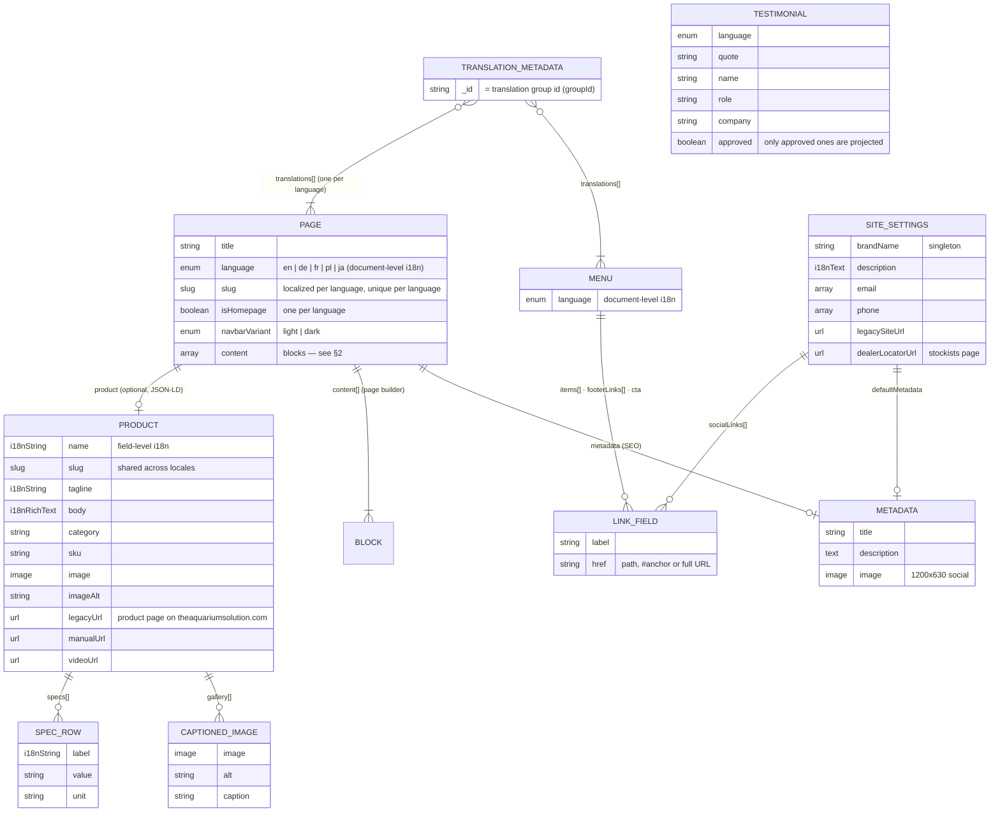
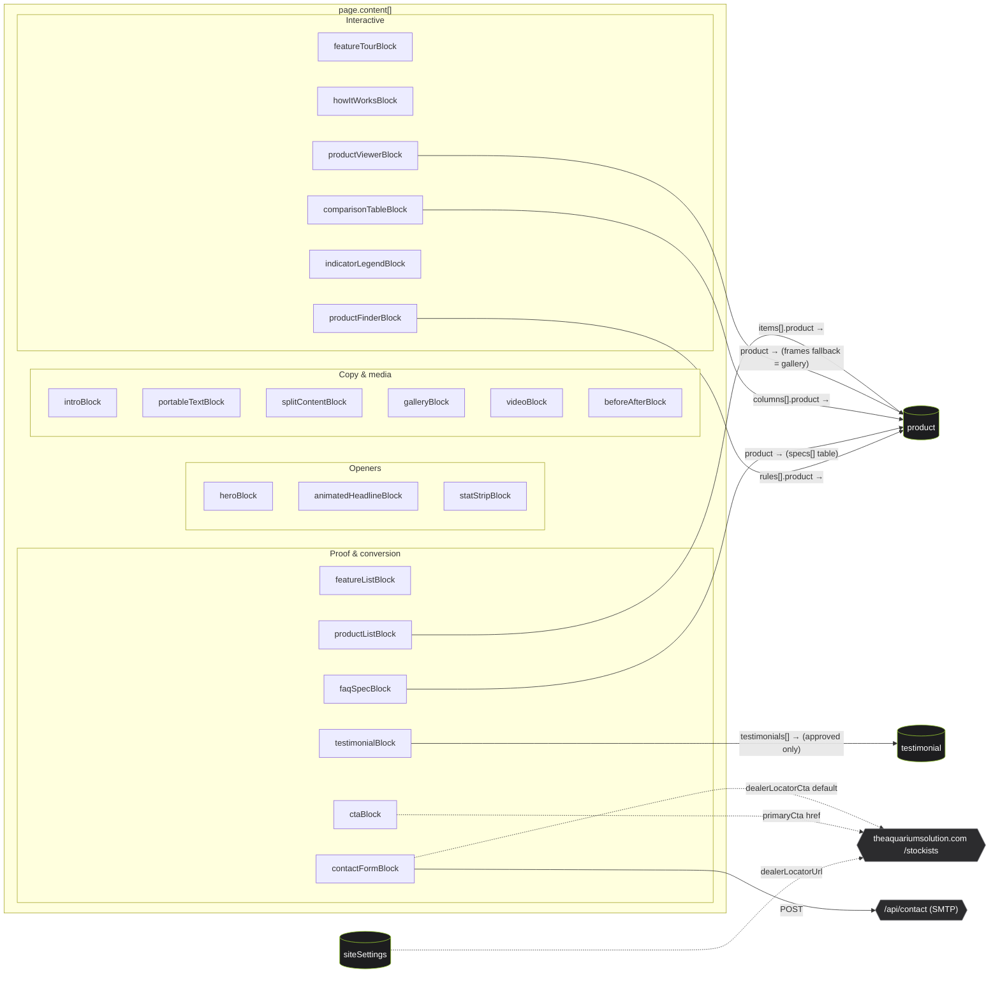
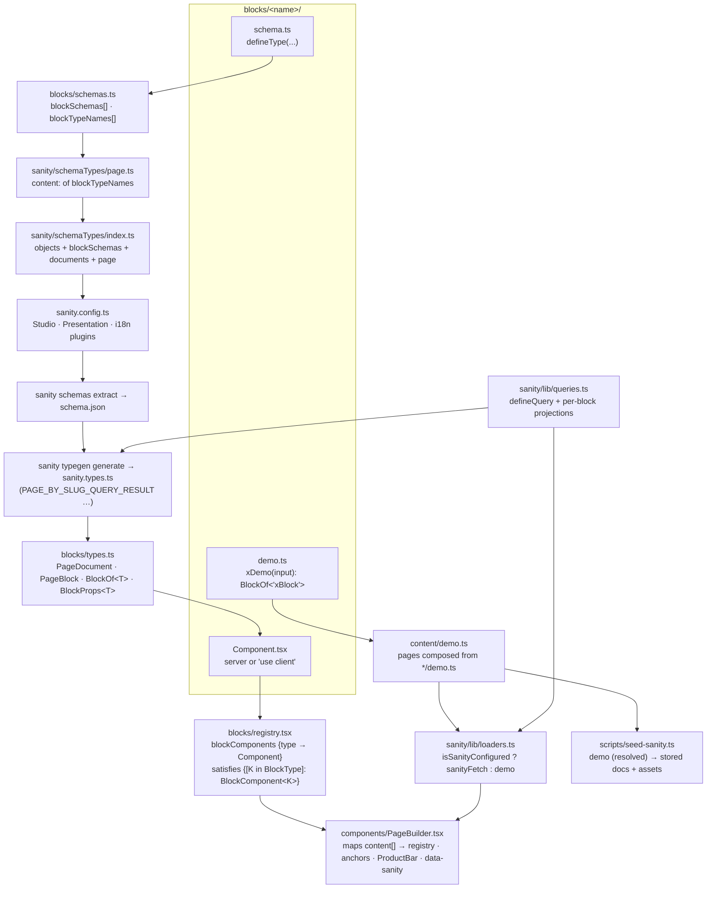
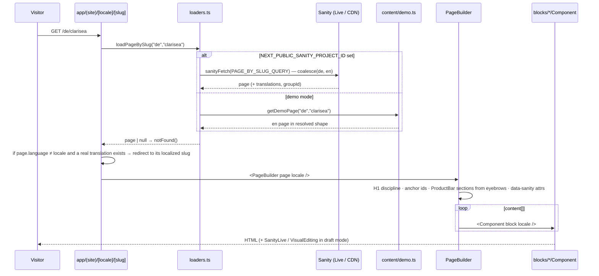

# Content schema & block architecture

How the Sanity content model, the page-builder blocks and the Next.js rendering pipeline fit together. Generated from the deployed schema (`schema.json`, 21 blocks · 6 documents · 25 objects) and the code in `blocks/`, `sanity/` and `components/`.

---

## 1. Content model — documents and what they reference



**Two i18n strategies, deliberately:** `page` and `menu` are **document-level** (`@sanity/document-internationalization` — one document per language, linked through `translation.metadata`, slug excluded from the copy so each language gets its own URL). `product` and `siteSettings` are **field-level** (`sanity-plugin-internationalized-array` — one document, `name[]/tagline[]/body[]/label[]` arrays keyed by `language`). Queries `coalesce()` the requested locale with `en`.

---

## 2. Blocks and their dependencies

Every block is an object type in `page.content[]`. Five blocks reach out to documents; the rest are self-contained.



### Block catalogue

| Block | What it renders | Key fields | References | Media | Runtime |
|---|---|---|---|---|---|
| `heroBlock` | Product hero: headline, whisper tagline, two pills, product image (or video) | `headline`\*, `summary`, `image`/`video` (one required), `imageAlt`\*, `primaryCta`, `secondaryCta`, `brand` | — | image, file (video) | server |
| `animatedHeadlineBlock` | Word-mask animated heading | `headline`\*, `level` h1/h2 | — | — | client |
| `statStripBlock` | Row of big tabular figures (count-up) | `stats[] {value\*, prefix, suffix, label\*}`, `tone` | — | — | client |
| `introBlock` | Centered headline + rich-text lead | `headline`\*, `body` (richText) | — | — | server |
| `portableTextBlock` | Long-form rich text (first h2 may be promoted to h1) | `body`\* (richText) | — | — | server |
| `splitContentBlock` | Image + copy two-up, reversible, toned | `headline`\*, `body`, `image`\*, `imageAlt`\*, `reverse`, `tone`, `cta` | — | image | server |
| `galleryBlock` | Grid of captioned images | `headline`\*, `images[]` (captionedImage) | — | image | server |
| `videoBlock` | Uploaded file or privacy click-to-load YouTube/Vimeo | `source`\* file/external, `file`/`url`, `poster`, `alt`\*, `caption`, `layout`, `autoplay`, `privacyNotice` | — | file, image | client |
| `beforeAfterBlock` | Draggable comparison slider | `before`\*, `after`\*, labels, `alt`\*, `startPosition`, `caption` | — | image ×2 | client |
| `featureTourBlock` | Scroll-driven tour: sticky media, steps animate in | `steps[] {title\*, body, image\*, imageAlt\*, stat, statLabel}` (min 2), `tone` | — | image per step | client |
| `howItWorksBlock` | Auto-advancing stepper with image per step | `steps[] {title\*, body, image, imageAlt, durationSeconds}` (min 2), `autoplay`, `tone` | — | image per step | client |
| `productViewerBlock` | 360° frame scrub + zoom (single frame = zoom-only) | `frames[]` (images), `alt`\*, `hint`, `autoRotate`, `product` | product (frames fallback) | image ×N | client |
| `productFinderBlock` | Calculator: volume + bioload → rule → model, roll life | `volumeMin/Max/Default`, `loadOptions[] {label\*, factor\*, rollFactor\*}`, `rules[] {maxEffectiveVolume, resultTitle\*, resultBody, flowLph, rollWeeks, product, cta}`, labels, `footnote` | product (per rule) | product image | client |
| `indicatorLegendBlock` | LED/alarm simulator + state list | `signals[] {name\*, ledColor, pattern, sound, meaning, action, severity}`, `deviceLabel` | — | — | client |
| `comparisonTableBlock` | Apple-style compare table | `rowHeader`, `columns[] {title\*, subtitle, product, highlight, cta}` (2–4), `rows[] {label\*, hint, cells[]}`, `footnote` | product (per column) | product image | server |
| `featureListBlock` | Tile grid of statements | `headline`\*, `intro`, `items[] {title\*, text}` | — | — | server |
| `productListBlock` | Product tiles linking to pages/legacy URLs | `headline`\*, `intro`, `items[] {product\*, link}` | product | product image | server |
| `faqSpecBlock` | Spec table (from product) + FAQ accordion + downloads | `product`, `showSpecs`, `specsHeadline`, `faqHeadline`, `faqs[] {question\*, answer\* richText}`, `downloads[]` | product | — | server |
| `testimonialBlock` | Quote tiles | `headline`, `testimonials[]`\* (refs) | testimonial | — | server |
| `ctaBlock` | Centered statement + pills | `headline`\*, `body`, `primaryCta`\*, `secondaryCta`, `tone` | — | — | server |
| `contactFormBlock` | Form → `/api/contact` (honeypot, timing, 5-locale subjects) | `headline`\*, `intro`, labels (EN defaults), `interestOptions[]`, feedback copy, `dealerLocatorCta` | — | — | client |

\* required. Every block also has an optional `eyebrow` — **not rendered above headings**; it becomes the section's label in the sticky product bar.

---

## 3. Code architecture — one folder per block, one registry



**Adding a block = one folder + two one-line registrations** (`schemas.ts`, `registry.tsx`); the page schema, Studio, TypeGen, PageBuilder, demo mode and seed all derive from those. The `satisfies` check in the registry fails the build if a schema has no component.

---

## 4. Query → projection map

`PAGE_BY_SLUG_QUERY` (and `HOME_PAGE_QUERY`) project `content[]{ ... }` with a conditional projection per block that needs dereferencing. Blocks without a line are projected as stored.

| Block | Projection adds |
|---|---|
| heroBlock | `image{asset->{_id,url,lqip,dimensions}}`, `video{asset->{_id,url,mimeType}}` |
| splitContentBlock, beforeAfterBlock | resolved image(s) |
| galleryBlock | `images[]{_key, alt, caption, image{asset->}}` |
| featureTourBlock, howItWorksBlock | `steps[]{..., image{asset->}}` |
| videoBlock | `file{asset->{_id,url,mimeType}}`, `poster{asset->}` |
| productViewerBlock | `frames[]{asset->}`, `product->{productFragment}` |
| productListBlock | `items[]{_key, link, product->{productFragment}}` |
| comparisonTableBlock | `columns[]{..., product->{productFragment}}` |
| faqSpecBlock | `product->{productFragment}` (specs feed the table) |
| productFinderBlock | `rules[]{..., product->{_id, slug, name (coalesced), image}}` |
| testimonialBlock | `"testimonials": testimonials[@->approved == true]->{_id, quote, name, role, company}` |

`productFragment` coalesces `name/tagline/body/specs[].label` to `$locale` → `en`, resolves `image`, `gallery[]`, `specs[]`, links. The page itself also gets `groupId` and `translations[]` from `translation.metadata` (hreflang, language switcher, en-fallback redirect).

---

## 5. Request → render



---

## 6. Where things live

```
sanity/schemaTypes/   page.ts · documents/{product,testimonial,menu,siteSettings} · objects/{linkField,metadata,richText,captionedImage,specRow} · fields/language.ts
blocks/<name>/        schema.ts · Component.tsx · demo.ts        (21 folders)
blocks/               schemas.ts · registry.tsx · types.ts · CONTRACT.md
sanity/lib/           queries.ts · loaders.ts · live.ts · client.ts · image.ts · video.ts
content/              demo.ts · demo-products.ts · demo-helpers.ts
components/           PageBuilder.tsx · SectionHeader · ActionLink · RichText · SanityImage · layout/{SiteHeader,ProductBar,SiteFooter}
scripts/              seed-sanity.ts (demo → Sanity) · make-placeholders.mjs · screenshot.mjs
```
